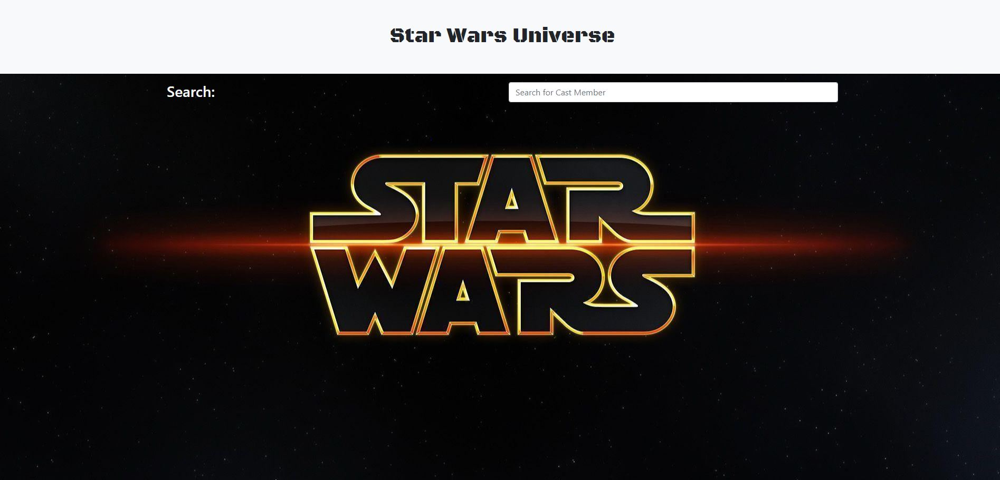

## Front-End Developer Test

## Contents

1. [Technologies-Used](#Technologies-Used)
2. [Description](#Description)
3. [Deploy](#Link)
4. [Usage](#Usage)
5. [Credits](#Credits)
6. [Contributing](#Contributing)
7. [Questions](#Questions)

## Technologies-Used

1. Javascript
2. Node.js
3. Node packages
   - bootsrap
   - react-router-dom
   - axios
4. React.js

## Description

- An Application that allows the user to search Star Wars Charaters, and movies.

## Deployed application link

- [Deployed Link](https://tolgas92.github.io/starwarsappwithjsx/)

## Usage

- User only needs to go to the deployed link, and search for a character.

- 

## Credits

- Created by Tolga Secme.

## Contributing

- No contributes.

##  Questions

- E-mail me for any questions [tolgasecme@icloud.com](mailto:tolgasecme@icloud.com)
- Also you can find me on Github [TolgaS92](https://github.com/TolgaS92).
